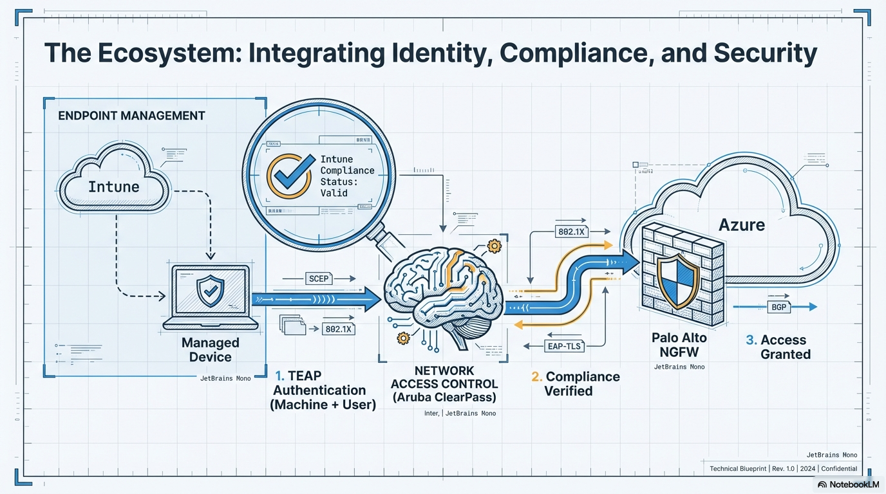

# security | edge protection and zero-trust

this module documents the security architecture, edge protection strategy, and zero-trust validation for the hybrid ecosystem.

---

## architectural ecosystem: identity & compliance
this blueprint visualizes the integration between endpoint management, network access control, and the palo alto ngfw.

---

## architecture modules

### [edge protection](./edge-protection/)
palo alto ngfw implementation including high availability (ha), ssl decryption, and perimeter security. **validation evidence and configuration exports for this service are centralized in the module-level hub.**

### [network access control (nac)](./network-access-control/)
aruba clearpass integration, teap authentication, and intune compliance verification. validation evidence is centralized in the module-level hub.

---

## navigation
* [**back to parent category**](../)
* [**back to main portfolio architecture**](../../)

---

**methodology note** > architectural visuals and slide evidence were generated by processing raw technical logs and running-configurations through notebooklm to ensure direct alignment with actual lab logic.